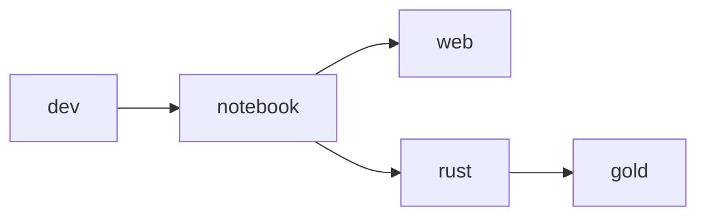

# Project Architecture
> 🚧 UNDER CONSTRUCTION

## Image Design
> [!NOTE]
> Images are built using GitHub Actions and deployed to the Github Container Registry, `ghcr.io`, under the username, `jhwohlgemuth`

The following images are available:
- `ghcr.io/jhwohlgemuth/dev`: Core image with all necessary system dependencies (intended for **dev**elopment)
- `ghcr.io/jhwohlgemuth/notebook`: Images with [Jupyter notebook](https://github.com/jupyter/notebook) server and [code-server](https://github.com/coder/code-server) services managed by [s6-overlay](https://github.com/just-containers/s6-overlay)
- `ghcr.io/jhwohlgemuth/web`: Web development environment and [Verdaccio](https://verdaccio.org/) proxy npm registry [1](#1)
- `ghcr.io/jhwohlgemuth/rust`: Environment ready for writing Rust code and working with WebAssembly
- `ghcr.io/jhwohlgemuth/gold`: Proof assistants, provers, and other tools for software correctness

The images are build according to the following dependency graph:

-------------

## Footnotes

### [1]
> Default Verdaccio proxy npm registry port is `4873` ([documentation](https://verdaccio.org/docs/configuration#listen-port))